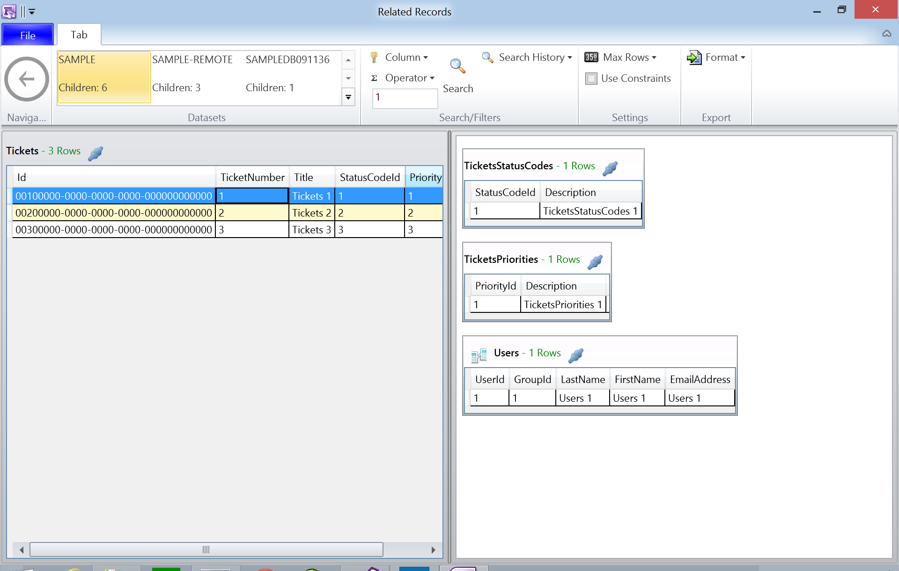
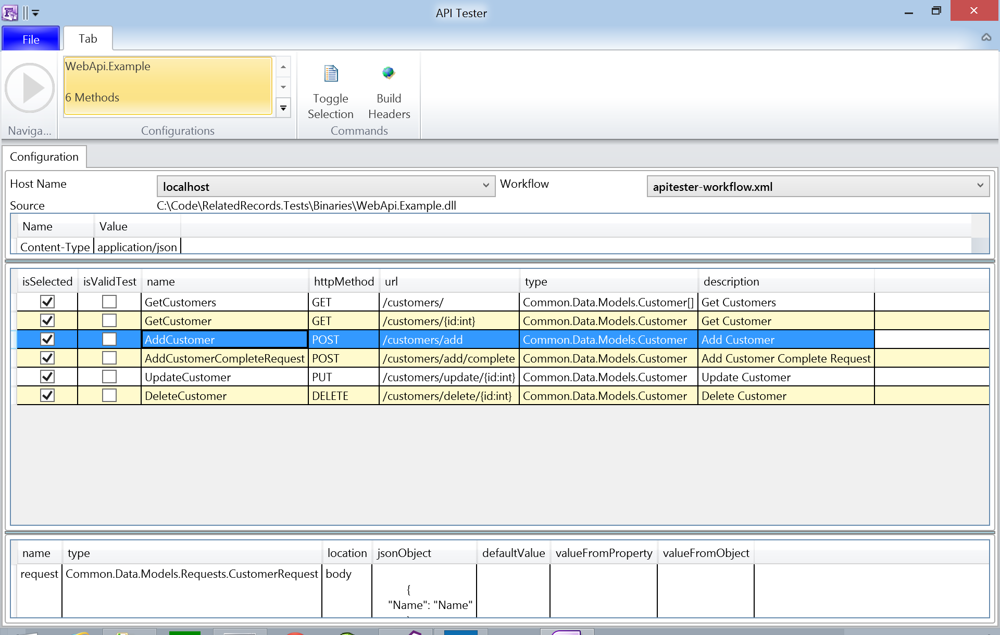
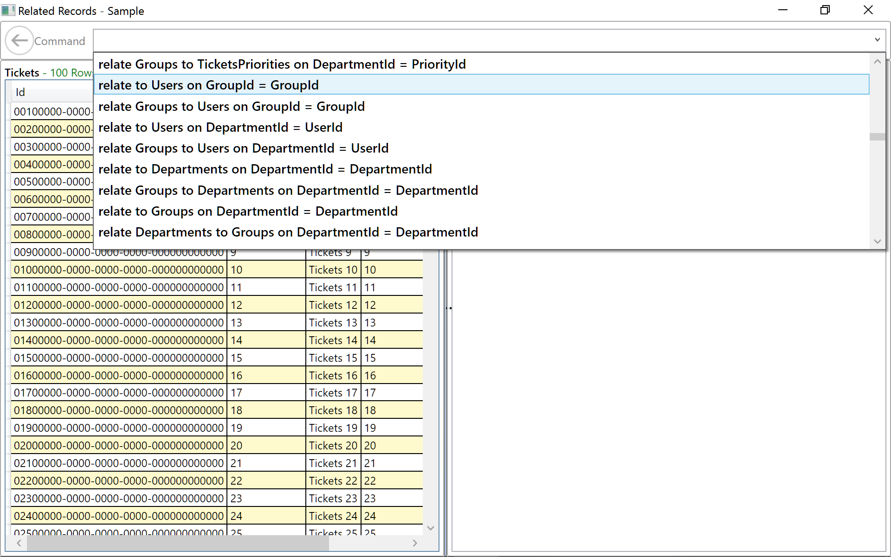
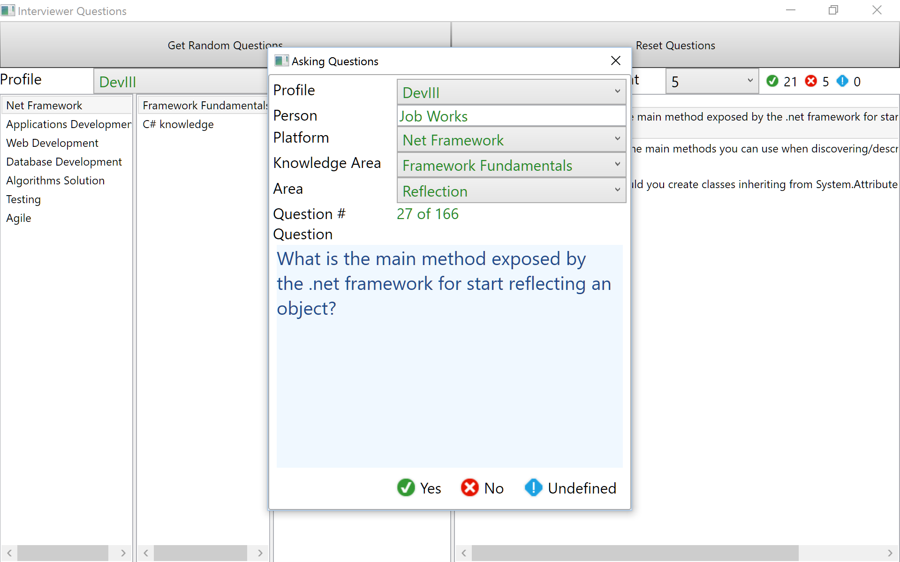

# Lab Experiments
## C# and Other Stuff ##

This is a series of lab experiment projects created for helping a developer in certain situations. They have been created just for **Fun and Joy** as of being a Developer and obviously to be helpful.

The projects created up to this moment are:
> Fluent Testing
> 
> Related Records
> 
> Api Tester
> 
> Reflector
> 
> Web Api Example
> 
> Related Records (Gold Parser) Project
> 
> WPF Interviewer Project

**Disclaimer**:
This projects are WIP (Work in Progress), and because of this they may not behave completely as (crashes are) expected, they will be soon.
Some code parts also may need some re-factoring in classes and its methods, please be aware this code has been developed in a rush manner.

They have been created from scratch using **MS Visual Studio**  on a **Microsoft Surface 3** with its corresponding **Type Cover**.
Also using **ReSharper** add-in.

Other tools, nuget packages used are:
> Newtonsoft.Json
> 
> Serilog
>
> Fluent
> 
> WPFSpark
> 
> Dapper
> 
> StringTemplate
> 
> ExportDll

## Fluent Testing Project ##

The **Fluent Testing** project is about hiding all of the assertion code when testing an object and making that process as Fluent as the **Natural Language**, English and Spanish in this case; all of this by using **.Net Reflection**.

The component classes are structured in such a way that helps the developer through the intellisense feature, to choose the right methods that follow in the sequence.

The library supports English and Spanish languages. To enable one or the other, just turn on/off the corresponding language compilation constant at project properties level:

> ENGLISH_LANGUAGE
> 
> SPANISH_LANGUAGE  

Sample code in **English**:
    
    	[TestMethod]
        public void It_Buildup_Test()
        {
            var item = new StringBuilder();

            "Test fluent interface building up"
                .On(item)
                .Call("Append")
                .WithParams("Hello")
                .ThenVerifyProps(new NameValue("Length", 5))
                .WithOtherParams(" World")
                .ThenVerifyProps(
                    new NameValue("Length", 11),
                    new NameValue("ToString", "Hello World", MemberTypes.Method))
                .WithOtherParams("!")
                .ThenVerifyProps(new NameValue("Length",
                    new Func<object, object, object>((len, result) => 12 == (int)len), MemberTypes.Custom))
                ;
        }

Sample code in **Spanish**:
    
		[TestMethod]
        public void It_Prueba_de_Construccion()
        {
            var objeto = new StringBuilder();

            "Probar la construccion de la interfaz fluida"
                .Sobre(objeto)
                .Llama("Append")
                .ConParametros("Hola")
                .LuegoVerificaPropiedades(new NameValue("Length", 4))
                .ConOtrosParametros(" Mundo")
                .LuegoVerificaPropiedades(
                    new NameValue("Length", 10),
                    new NameValue("ToString", "Hola Mundo", MemberTypes.Method))
                ;
        }

**What's missing** in this project:
This is just a placeholder to start up building a very robust fluent testing light framework helper on top of any Testing Framework like **NUnit** or other of the well know frameworks, but useful enough for being used in real daily code testing. More methods need to be added to support testing property values like: GreaterThan, Equals, etc. This latest missing methods will be used by the WebApi tester project.

## Related Records Project ##
The **Related Records** project is about making easy for a business developer/analyst to see given a database schema what table records are related to each other table records and let the developer/analyst navigate back and forth and drilling down as much as possible through the data entities. This is a **WPF** Windows application.

This application works around the **XML** configuration for tables and its relationships. Main objective of this and the other projects is to achieve their intended purpose by using as much as possible configuration items.

Related data may be exported as a JSON, XML or HTML string/file, etc. Currently supports exporting to **HTML** and as **SQL** inserts script. It has the potential to be used as an Evidence of the results after applying a series of test cases, from the Testing documentation process.

**What's missing**: This is just the start up for building a business data oriented application utility for the data review tasks we developers/analysts need to do in a daily basis. This code also needs further more coding to properly handle/log exceptions. Also a lot of testing against all of the available SQL column types. Exporting data also needs to export only those records being displayed by the Filter string.

## Api Tester Project ##
The **Api Tester** project is about making easy to test Web Api **REST** services with a single click of the mouse. This application can be used as a typical case when you already have your Api methods in place and from them through **Reflection** generate all needed XML configuration artifacts to automate the process of testing how well your services are doing. This is a WPF Windows application using also **Curl.exe** to query the Api.

This tool can also very helpful with the **integration** of **UI** and **back-end** development teams, since shows the Api contracts and real examples of **Requests/Responses** being used/provided.

This application works around the **XML** configuration for methods and the **workflows** they should follow. Main objective of this and the other projects is to achieve their intended purpose by using as much as possible configuration items.

Sample api configuration generated: 

    <apiConfiguration xmlns:utils="urn:schemas-reflector-com:xslt">
      <setup commandLine="C:\Program Files (x86)\Git\bin\curl.exe" source="C:\RelatedRecords.Tests\Binaries\WebApi.Example.dll">
        <host name="localhost">http://localhost:60264</host>
    <host name="remotehost">http://remote:60264</host>
    <header name="Content-Type" value="application/json" />
    <buildHeader name="Authorization" provider="ApiTester.Providers.Default">
      <task name="Authenticate" pattern="myhost/doauth">
        <parameter name="User" defaultValue="me" />
        <parameter name="Password" defaultValue="pwd" />
        <task name="GetToken" pattern="myhost/gettoken">
          <parameter name="code" />
        </task>
      </task>
    </buildHeader>
    <workflow name="apitester-workflow.xml" />
      </setup>
      <method name="GetCustomers" httpMethod="GET" url="/customers/" type="Common.Data.Models.Customer[]" description="Get Customers" />
      <method name="GetCustomer" httpMethod="GET" url="/customers/{id:int}" type="Common.Data.Models.Customer" description="Get Customer">
        <parameter name="id" type="System.Int32" location="query" />
      </method>
      <method name="AddCustomer" httpMethod="POST" url="/customers/add" type="Common.Data.Models.Customer" description="Add Customer">
        <parameter name="request" type="Common.Data.Models.Requests.CustomerRequest" location="body">
    </parameter>
      </method>
    ...

Sample Api workflow generated:
 
    <workflow name="WebApi.Example" xmlns:utils="urn:schemas-reflector-com:xslt">
      <task name="GetCustomers" />
      <task name="GetCustomer">
        <parameter name="id" type="System.Int32" location="query" defaultValue="1" />
      </task>
      <task name="AddCustomer">
        <parameter name="request" type="Common.Data.Models.Requests.CustomerRequest" location="body">
      <jsonObject>
        <![CDATA[
          {
    "Name": "Name"
          }
          ]]>
      </jsonObject>
    </parameter>
    <task name="DeleteCustomer">
      <parameter name="id" type="System.Int32" location="query" defaultValue="1" valueFromObject="" valueFromProperty="Id" />
    </task>
    </task>
    ...
        
What's behind this project is an insight of the need to provide a full solution to the problem of automating the generation of code and all of the involved software development cycle artifacts like documentation, system tables, store procedures, workflows, etc.

A future project could be the automation of the generation of all of this software artifacts.

**What's missing**: This is just the start up for building a powerful Web Api services testing tool. It needs a visual workflow designer, since for now only default workflow is automatically created via **XSLT** and through the Reflector (builder) console application.

Also needs some coding to visually include another Api configurations and its workflows and displaying image icons instead of checkboxes for passed tests, allow single selection for running tests.

One important feature also missing is the verification of results to check against property values using the Fluent Testing project. This is the current task being developed now.

## Reflector Project ##
The **Reflector** project (builder) is about reflecting a given assembly to an **XML** definition through **Reflection**. Does not reflects everything, but what's needed for the **Api Tester** project. It can generate XML definitions for a single assembly of for a complete path containing as much assemblies as wished. This is a Windows **Console** application.

Can also be used to transform generated Web Api XML definitions into any given file objects like **Swagger YAML** definition, **I/O Docs JSON** definition, **PostMan** collection definitions, etc. You name IT!; all of this via **XSLT**. Some samples of this XSLT files are provided.

This application works around the **XML** configuration for methods and the **workflows** they should follow. Main objective of this and the other projects is to achieve their intended purpose by using as much as possible configuration items.
 

    Builder usage:
        builder [<file>.dll] [options]
        builder [options]
           example:
             builder WebApi.Example.dll -t Controller

        where options are:
                -p <path>
                        specifies the path to process. example: is c:\mybin\ or .
                -x <path>.xsl[t]
                        specifies the xsl file path to process.
                -o ext
                        specifies the file extension for the xslt transformation.
                -r <option>
                        where option can be xml. xslt or text. Default xml
                -i
                        include .NET System.Object methods
                -t <type list>
                        list of only types (comma separated) to process
                -m <type list>
                        list of only methods (comma separated) to process

**What's missing**: This is just the start up for building a powerful yet simple **Assembly to XML** reflector tool. It needs a simplified command line arguments handler like the command line **nuget** package.

Also needs extra coding to properly handle exceptions/logging, and many more types/attributes support.

## Web Api Example Project ##
The **Web Api Example** project is just a quick Web Api example with some dummy methods and an XML repository to provide some Customer/Products/Categories objects. Is the basis to be Reflected by the **Reflector** project in order to generate the **Api Tester** XML definitions. This is an **ASP.NET WEB API** application.

Notice Controllers and its methods are decorated with some **Attributes** to fully support the **reflection** process.
 

    [RoutePrefix("customers")]
    public class CustomersController : ApiController
    {
        private readonly IRepository<Customer> _repository;
		...

        [Route("{id:int}"), HttpGet]
        [ResponseType(typeof(Customer))]
        public IHttpActionResult GetCustomer(int id)
        {
            var customer = _repository.GetById(id);
            if (null == customer) return BadRequest("Customer not found");

            return Ok<Customer>(customer);
        }

**What's missing**: For its purpose is fine what is being coded, some extra objects/data types may need to be included to fully help with the **ApiTester** project. Xml repository needs to be well coded to be really consistent for implementing full/good testing.

## Related Records (Gold Parser) Project ##
The **Related Records (Gold Parser)** relates to the **Related Records** original project, due uses its **XML** configuration, but code functionality is based on parsing expressions in a command fashion way through the [Golden Parser](http://www.goldparser.org/ "Gold Parser") library. This is also a **WPF** Windows application.

Same features are available than in the **Related Records** project.

Available commands are auto generated in some sort of intellisense fashion.

**What's missing**: This code is some sort of **Proof of Concept** demonstration and needs further debugging/testing.

## WPF Interviewer Project ##
The **WPF Interviewer** project allows an interviewer ask questions to a possible candidate for a business position on any area of interest depending on what you configure in its **XML** configuration. Once you choose to get random questions then you are able to start the interview process.  This is also a **WPF** Windows application.

**What's missing**: This code is some sort of **Proof of Concept** demonstration although is fully functional. Some persistence needs to be set in place so the asked questions and its approval/dismissal/etc. are saved and from them generate some sort of report. 

Some **XML schema** changes also need to be done to support required and optional questions.

There is also a **WUP** Windows Universal Project (One app for Windows Store and another for a Windows Phone platform) for this interviewer app, already in progress of development which basically should reuse the models and view models of the **WPF interviewer** project.

## Python Labs Project ##
The **Python Labs** project converts plain **Text** into an    **XML** configuration file for the **WPF Interviewer**.

This project will use Python classes instead of procedural code for generating the **XML** tags.